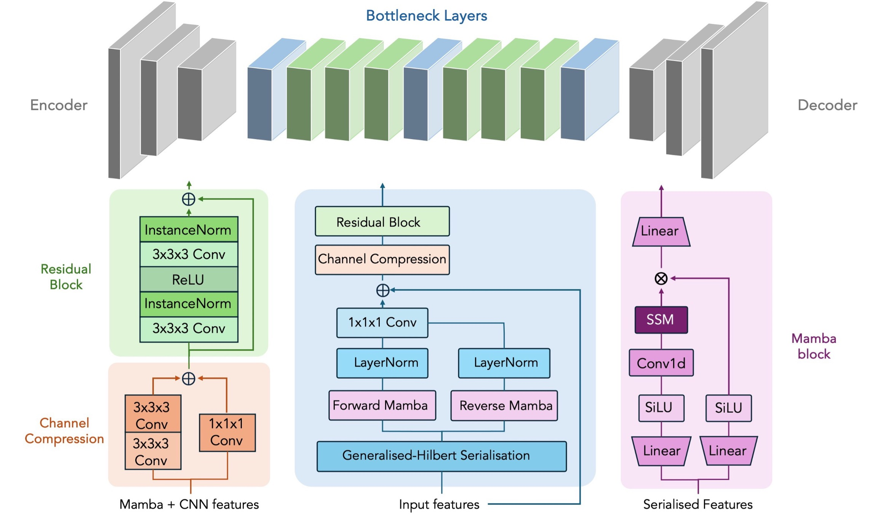

# GAMBAS

Official PyTorch implementation of **GAMBAS**, a Mamba infused adversarial model, leveraging a generalised-Hilbert scan to process 3D medical imaging data with state-space models (SSMs).

### Preprocessing

Before training the model, register input images to corresponding target images and ensure files are arranged in the following format:

	├── Training_data                   
	|   ├── images               
	|   |   ├── 0.nii 
  	|   |   ├── 1.nii 
	|   |   └── 2.nii                   
	|   ├── labels                       
	|   |   ├── 0.nii 
  	|   |   ├── 1.nii 
	|   |   └── 2.nii 

 ### Training

Modify "BaseOptions.py" to set directory for preprocessed training data (--data path) and validation data (--val_path). Select model that will be used for training by modifying --model (e.g. gambas, cycle_gan, ea_gan) and make sure correct patch size is specified via --patch size. Finally, set checkpoint directory (--checkpoints_dir) and project name (--name).

For standard training use train.py, or to integrate TensorBoard logging use train_TB.py

### Prediction

Modify "TestOptions.py" to specify input image and output name, then run "test.py" to obtain prediction. If using our-pretrained model (see below), make sure to rigidly register input image to the template provide (Template.nii.gz). This will ensure the input image has the same size and resolution as our training data.

### Pre-trained model

Download pretrained weights here:

    
