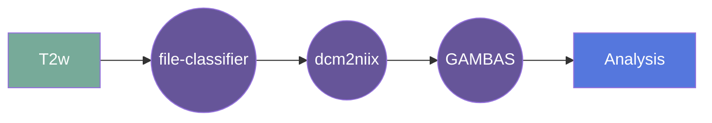

# GAMBAS
### Generalised-Hilbert Mamba for Super-resolution of Paediatric Ultra-Low-Field MRI

## Overview

[Usage](#usage)

[FAQ](#faq)

### Summary
A hybrid CNN and state-space model (SSM) architecture featuring a novel 3D to 1D serialisation (GAMBAS), which learns long-range context without sacrificing spatial precision. The model is trained on peadiatric Hyperfine Swoop scans from low- and middle-income countries (LMICs), providing super-resolution of ultra-low-field MRI data. 

The output file labels are based on the BIDS standard, taking the input file name and appending the appropriate suffixes. For example if the input file is `sub-01_ses-01_T1w.nii.gz`, the output files will be named `sub-01_ses-01_T1w_gambas.nii.gz`

### Cite

**license:**

**url:** <https://github.com/levente-1/GAMBAS/tree/fw-dev>

**cite:**  
Baljer, L., Zhang, Y., Bourke, N.J., Donald, K.A., Bradford, L.E., Ringshaw, J.E., Williams, S.R., Deoni, S.C.L., Williams, S.C.R., , Váša, F. and Moran, R.J. (2025), Ultra-Low-Field Paediatric MRI in Low- and Middle-Income Countries: Super-Resolution Using a Multi-Orientation U-Net. Hum Brain Mapp, 46: e70112. https://doi.org/10.1002/hbm.70112

### Classification

*Category:* analysis

*Gear Level:*

* [ ] Project
* [x] Subject
* [x] Session
* [ ] Acquisition
* [ ] Analysis

----

### Inputs

* api-key
  * **Name**: api-key
  * **Type**: object
  * **Optional**: true
  * **Classification**: api-key
  * **Description**: Flywheel API key.

### Config

* input
  * **Base**: file
  * **Description**: input file (axial or isotropic reconstruction)
  * **Optional**: false

### Outputs
* output
  * **Base**: file
  * **Description**: super resolved image
  * **Optional**: false

#### Metadata

No metadata currently created by this gear

### Pre-requisites

- Three dimensional structural image

#### Prerequisite Gear Runs

This gear runs on BIDS-organized data. To have your data BIDS-ified, it is recommended
that you run, in the following order:

1. ***dcm2niix***
    * Level: Any
2. ***file-metadata-importer***
    * Level: Any
3. ***file-classifier***
    * Level: Any

#### Prerequisite

## Usage

This section provides a more detailed description of the gear, including not just WHAT
it does, but HOW it works in flywheel

### Description

This gear is run at either the `Subject` or the `Session` level. It downloads the data for that subject/session and then runs the
`gambas` module on it.

After the pipeline is run, the output saved into the analysis
container.

#### File Specifications

This section contains specifications on any input files that the gear may need

### Workflow

A picture and description of the workflow

Description of workflow

1. Upload data to container
2. Prepare data by running the following gears:
   1. file classifier
   2. dcm2niix
3. Run the GAMBAS gear
4. Output data is saved in the container

### Use Cases

## FAQ

[FAQ.md](FAQ.md)

## Contributing

[For more information about how to get started contributing to that gear,
checkout [CONTRIBUTING.md](CONTRIBUTING.md).]
